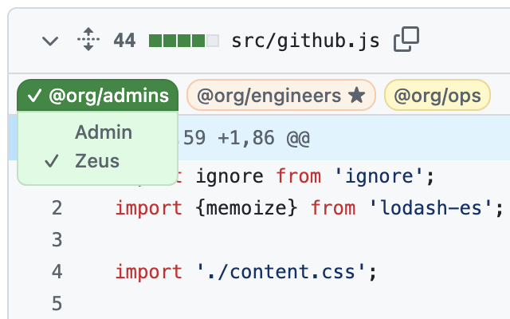
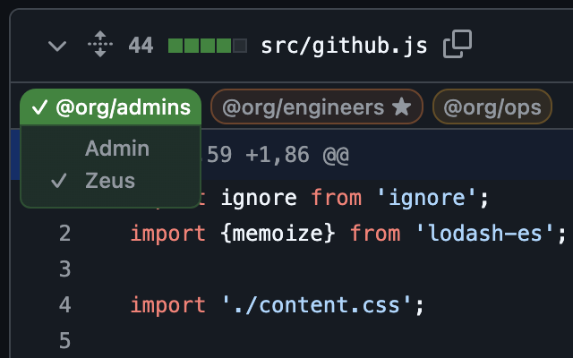

#  GitHub Codeowners

GitHub Codeowners Browser Extension




## Features

Decorate PR file headers with labels showing the owners who must approve that file

- Owner labels of teams that you're a member of are shown in red and have a star (★)
- Owner labels of teams that have already approved are shown in green and have a checkmark (✓)
- The star becomes lighter in your own teams that have approved (☆)
- Hovering on an owner label shows a drawer with the members of that team
- Clicking an owner label highlights that owner label in all file headers

Does not require a GitHub access token

## Install

### Chrome

Install from [Chrome Store](https://chromewebstore.google.com/detail/GitHub%20Codeowners/bleicmjinodghcdonmnfgmjmhgnhppbk)

### Firefox

Install from [Firefox Add-ons](https://addons.mozilla.org/en-US/firefox/addon/github-codeowners/)

## Building

> [!TIP]
> If you don't already have Node.js and npm, you'll need to [install](https://docs.npmjs.com/downloading-and-installing-node-js-and-npm) them first.

```
npm install
npm run build
```

The extension will be in the `build/` directory.

## Privacy

All data collected by this extension is kept and used only within the browser; it is not transmitted out of the extension.

The data collected includes:
* The username of the logged-in GitHub user is read from the page metadata.
* The usernames and team names mentioned in the `CODEOWNERS` file are collected and cached in memory.
* Team member usernames for teams mentioned in `CODEOWNERS` are collected and cached in memory.

> [!NOTE]
> Any GitHub access token that was previously stored by v0.1.0 of the extension will be deleted from storage.

---

This project was bootstrapped with [Chrome Extension CLI](https://github.com/dutiyesh/chrome-extension-cli)

<!-- Fake change for screenshot demo -->

