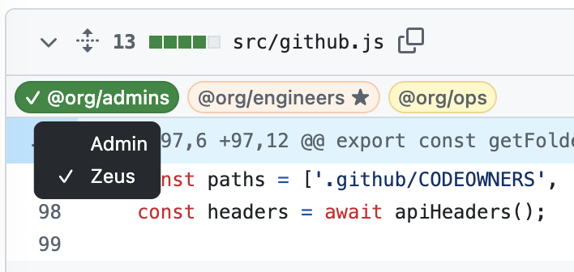

#  GitHub Codeowners

GitHub Codeowners Browser Extension



## Features

- Decorate each file header with labels showing the owners who must approve that file
- Owner labels of teams that you're a member of are shown in red and have a star (★)
- Owner labels of teams that have already approved are shown in green and have a checkmark (✓)
  - The star becomes lighter in your own teams (☆)
- Hovering on an owner label shows a tooltip with the members of that team
- Clicking an owner label expands all the files with that owner, and collapses the others

## Install

The plan is to get these into the Chrome and Firefox stores, but until then clone this repo and build it locally.

> [!TIP]
> If you don't already have Node.js and npm, you'll need to [install](https://docs.npmjs.com/downloading-and-installing-node-js-and-npm) them first.

Build the extension:
```
npm install
npm run build
```
... then from the resulting `build/` directory
* Chrome: [Load unpacked](https://developer.chrome.com/docs/extensions/get-started/tutorial/hello-world#load-unpacked) extension
* Firefox: [Install](https://developer.mozilla.org/en-US/docs/Mozilla/Add-ons/WebExtensions/Your_first_WebExtension#installing) as a tempory add-on

> [!IMPORTANT]
> After installing the extension, if your repo needs a GitHub token to access it, paste it in the extension's popup UI by clicking on its icon.

## Contribution

Suggestions and pull requests are welcomed!.

---

This project was bootstrapped with [Chrome Extension CLI](https://github.com/dutiyesh/chrome-extension-cli)

