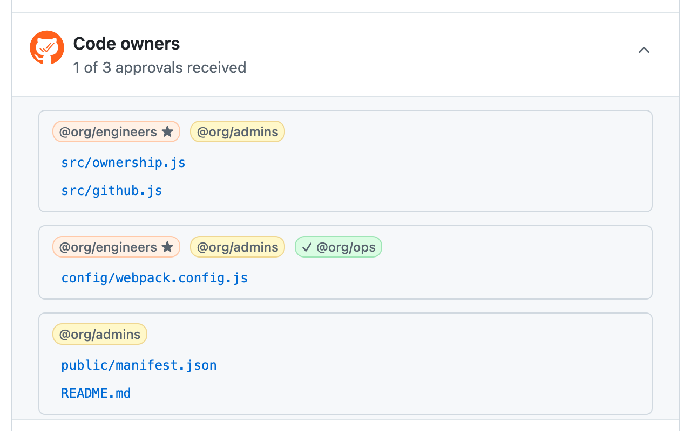
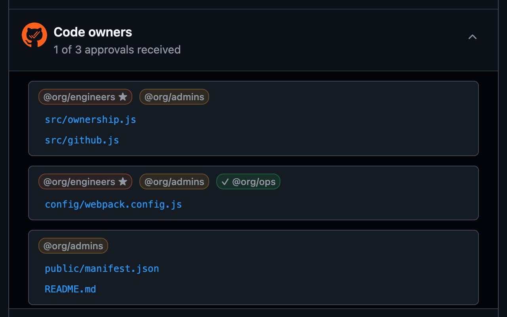

#  GitHub Codeowners

GitHub Codeowners Browser Extension





## Features

Decorate GitHub PR pages with code ownership and approval status \
Does not require a GitHub access token

**Decorations:**
- Code owners section on the PR conversation page showing *owner labels* for who needs to approve groups of files
- *Owner labels* in file headers on the files tab and compare view
- Icons indicating role of commenters
  -  PR author
  -  code owner
  -  other contributor

***Owner Labels:***

- Hovering shows a drawer with the members of that team
- Clicking expands that owner's files and collapses the others
- Appearance indicates approval status and your team membership
  - 🔴 **Red**: Pending your approval
  - 🟡 **Yellow**: Pending approval from others
  - 🟢 **Green**: Approved
  - ★ **Star**: Your team
  - ✓ **Checkmark**: Approved

See [CHANGELOG.md](CHANGELOG.md) for version history.

## Install

### Chrome

Install from [Chrome Store](https://chromewebstore.google.com/detail/GitHub%20Codeowners/bleicmjinodghcdonmnfgmjmhgnhppbk)

### Firefox

Install from [Firefox Add-ons](https://addons.mozilla.org/en-US/firefox/addon/github-codeowners/)

## Building

> [!TIP]
> If you don't already have Node.js and npm, you'll need to [install](https://docs.npmjs.com/downloading-and-installing-node-js-and-npm) them first.

```
npm install
npm run build
```

The extension will be in the `build/` directory.

## Privacy

All data collected by this extension is kept and used only within the browser; it is not transmitted out of the extension.

The data collected includes:
* The username of the logged-in GitHub user is read from the page metadata.
* The usernames and team names mentioned in the `CODEOWNERS` file are collected and cached in memory.
* Team member usernames for teams mentioned in `CODEOWNERS` are collected and cached in memory.

> [!NOTE]
> Any GitHub access token that was previously stored by v0.1.0 of the extension will be deleted from storage.

---

This project was bootstrapped with [Chrome Extension CLI](https://github.com/dutiyesh/chrome-extension-cli)

